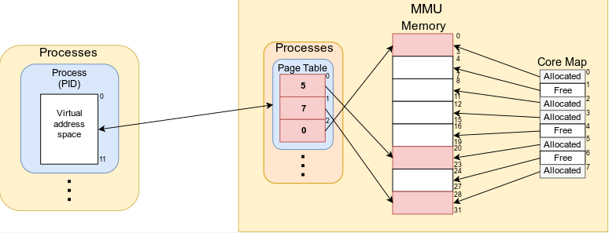
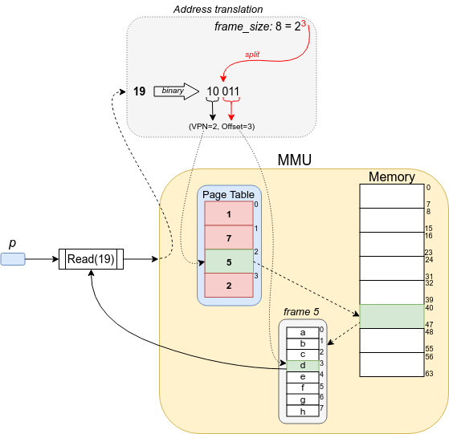

# Lab 5: Memory Management

| Lab 5: | Memory Management |
| ---------------------    | --------------------- |
| Subject:                 | DAT320 Operating Systems and Systems Programming |
| Deadline:                | **October 18, 2022 23:59** |
| Expected effort:         | 20-30 hours |
| Grading:                 | Pass/fail |
| Submission:              | Group |

## Table of Contents

1. [Introduction](#introduction)
2. [Implementing the MMU for Paged Memory](#implementing-the-mmu-for-paged-memory)
3. [Architecture](#architecture)
4. [Task 1: Multiple Choice Questions About Memory Management](#task-1-multiple-choice-questions-about-memory-management)
5. [Task 2: Memory Allocation](#task-2-memory-allocation)
6. [Task 3: Reading and Writing](#task-3-reading-and-writing)
7. [Task 4: Freeing Memory](#task-4-freeing-memory)

## Introduction

In this task you will implement various low-level functions used by the Memory Management Unit (MMU).
By the end of this task you will have a working MMU which manages a memory divided into fixed-size physical page frames.
Frames can be allocated to or deallocated from processes, and processes will also be able to write to and read from their allocated memory.
The memory segmentation, address translation, etc. in this lab is based on [Chapter 18 of the textbook](http://pages.cs.wisc.edu/~remzi/OSTEP/vm-paging.pdf).

We have included a few files which you must use as a starting point for your assignment.

* `mmu.go`. This is where most of your code will be.
  It includes a skeleton of the `MMU` struct with some of its necessary data structures, as well as the function header for some necessary functions.
* `process.go`. The code in this file is already complete and you should not change this file.
  It contains the `Process` struct and several methods that use the `MMU` struct to allocate and use memory.
* `pagetable.go`. This file contains the `PageTable` struct, which is used by the MMU to track translations from virtual page numbers to physical frame numbers.
* `freelist.go`. This file contains the `freeList` struct as well as some related utility methods.

After most tasks you should run a test to verify that your code is working as expected.
This step is important, because these tests and more are used in QuickFeed, and later parts of the lab depends on the code working as expected.

## Implementing the MMU for Paged Memory

### Architecture

In this section you will implement the core functionality of the MMU.
In this lab, the memory is divided using a method called paging, where the memory is called *paged memory*.
Paged memory consists of several fixed-size *physical frames*. Physical frames have two possible states: *free* and *allocated*.
The state of all physical frames of the memory is tracked in the *free list*, sometimes also called *core map*, as in the figure below.
The architecture for paged memory is illustrated in the figure below.



Each physical frame can be allocated to a process.
Allocated frames are added to the process's *virtual address space*.
Here, the process looks at its allocated memory as a continuous memory segment starting from the address 0, which the process has full control over.
Later on, a process will be able to do many operations on its address space, such as read from and write to it, expand it, and free physical frames from it.

To keep track of the virtual address space of each process, we use a structure called a *page table*.
The page table is a per-process data structure which contains translations from virtual page numbers (VPNs) to physical frame numbers.
Whenever a physical frame is allocated to a process, a translation from a virtual page number to a physical frame number is appended to its page table.

As mentioned, the state of physical frames will be tracked in the *free list*, `MMU.freeList`.
The length of the free list equals the number of physical frames.
The free list contains an entry for each physical frame which contains a boolean to indicate whether a physical frame is free, i.e.
available for allocation, or already allocated.
For simplicity, the index of an entry in the free list corresponds to the physical frame number it represents, e.g. `freeList[0]` shows the state of physical frame 0 and `freeList[7]` shows the state of physical frame 7.

`MMU.processes` is a map used to store references to each process's page table, where the key is the PID and the value is a pointer to the corresponding process's page table.

### Task 1: Multiple Choice Questions About Memory Management

Answer these multiple choice questions about [Memory Management](mmu_questions.md).

### Task 2: Memory Allocation

In this task you will structure the memory and implement allocation.
You must implement the `NewMMU()` and `MMU.Alloc()` functions.

#### Initialization

First, you must implement the `NewMMU` function.
Note that the memory is divided into frames `MMU.frames[i][j]`, where `i` signifies the physical frame number and `j` signifies the offset within that frame.
The frame size is a parameter to `NewMMU()`.
Use this information to divide `MMU.frames` into the correct amount of frames.
Also, each frame must have an entry in `mmu.freeList` to represent its state.

#### Allocating Memory

Next, you must implement allocation.
Allocation occurs when a process sends a request to the MMU using `Process.Malloc()`, requesting a certain amount of bytes of memory.
The MMU must check whether enough free memory is available, and if it is, must find a number of pages by checking the free list, and add these pages to the process's page table.

Add the following functionality to `MMU.Alloc()`:

1. Calculate the number of frames the process needs.
   Memory is only allocated as physical frames.
   As such, the amount of memory allocated to a process is always a multiple of the frame size.
   For example, if the frame size is 4, and a process requests 6 bytes, the MMU must allocate 2 frames to the process which have room for 8 bytes in total.
   If there are not enough frames available, the function should return an error.
2. Find which frames to be allocated by scanning the free list.
   You should always pick free frames with the lowest physical frame number (i.e. lowest free list index).
   Remember to update the free list to reflect which frames have been allocated.
3. Add the selected frames to the process's page table.
   If the process doesn't have a page table yet you need to create one and add it to `MMU.processes`.
   Use `PageTable.Append()` to add pages to the process's page table.

#### Memory Allocation Tests

Run the following commands to test your solution:

```sh
go test -run TestNewMMU
go test -run TestPTAppend
go test -run TestAlloc
```

### Task 3: Reading and Writing

In this task, you will implement write and read functions for the MMU.

#### Virtual Addresses

As explained earlier, processes have a virtual address space which the MMU keeps track off by storing a page table for each process.
Each process has a virtual address space that starts at address 0.
Processes use a *virtual address* to determine the location they want to read from or write to within their address space.
A valid virtual address can be translated to a single physical memory address, which in the case of this lab refers to a memory cell containing a single byte.

A virtual address has a special format.
In the binary format, the *len* - *n* highest order bits determine the *virtual page number*, while the *n* lowest order bits determine the *offset* within the *physical frame* pointed to by the aforementioned virtual page.
*len* is the total length of the virtual address, while *n* is given by `log_2(frame_size)`.

The virtual address translation process is illustrated in the figure below:



In the figure, *p* sends the request `Read(19)` to the MMU.
Since the frame size is 8, the address is split after the third bit.
`VPN = 2` means we use the physical frame number translation at index 2 of the page table of process *p*, which gives us the physical frame 5.
Finally we access the byte at `offset = 3` within physical frame 5.

To support virtual address translation, reading and writing, add the following functionality:

1. Implement the `extract()` function and the `translateAndCheck()` method in `mmu.go`.
2. Implement `PageTable.Lookup()` which must be used for virtual page number to physical frame number translation for the process that wants to read/write.
3. Implement `MMU.Write()`. A process wants to write *n* bytes to its address space, starting from a certain virtual address *a*.
   For each of the *n* bytes in the sequence you have to write to the next virtual address in order.
   1. If the starting address is illegal, i.e. outside of the process's address space, return an error.
   2. If the starting address is legal, but starting address + *n* exceeds the process's address space, the MMU should try to allocate as much memory as necessary to the process in order for it to write.
   3. If there is not enough free memory to allocate to the process in the case above, return an error without allocating anything.
4. Implement `MMU.Read()`. Similarly, a process wants to read *n* bytes from its address space, starting from a certain virtual address *a*.
   The *n* bytes have to be returned in the order of their virtual address.
   1. If the starting address or the final address is illegal, i.e. outside of the process's address space, return an error.

#### Tests for Virtual Address Translation, Reading and Writing

Run the following commands to test your solution:

```sh
go test -run TestExtract
go test -run TestPTLookup
go test -run TestWrite
go test -run TestRead
```

### Task 4: Freeing Memory

In this task, you must implement the `MMU.Free()` function to allow processes to free pages.
`Process.Free()` tells the MMU that the process wants to free *n* pages from its address space.
The process to free memory involves several steps.

1. Implement `PageTable.Free()` which must free the *n* last entries from the process's page table.
2. Zero out the content of the memory that was freed, so that other processes cannot read the previous memory contents if the memory is reallocated.
3. Add the frames that were freed to the free list.

#### Tests for Freeing Memory

Run the following commands to test your solution:

```sh
go test -run TestPTFree
go test -run TestFree
```

You should also run the `TestSequences` test which will test a combination of allocation, reading, writing and freeing:

```sh
go test -run TestSequences
```
